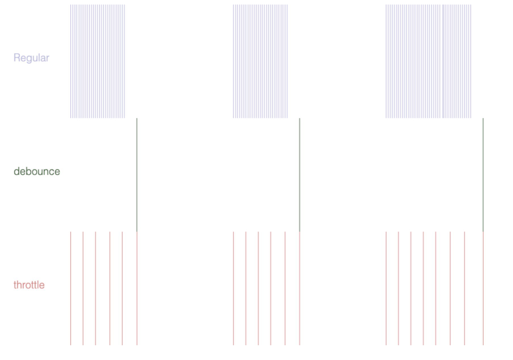

# JS的防抖与节流

什么是`防抖`？什么是`节流`？它们有什么区别？

### 一、概念

**函数防抖（debounce）**

> 当调用动作过n毫秒后，才会执行该动作，若在这n毫秒内又调用此动作则将重新计算执行时间。

它来源于`机械开关`与`继电器`上的`接点弹跳`，开关与继电器的接点通常由弹性金属制成。当接点一起敲击，接点在冲力与弹力一起作用下，导致弹跳部分在接点`稳定前`发生`一次`或`多次`。结果就是一个快速脉冲电流取代了从零到全电流的明确转换。此效应在电源电路中通常不重要，但是在某些类比电路或逻辑电路上就会引起问题，因为这种快速开关反应足够快到会导致上述电路将这类开关脉冲误以为是资料流。

由此衍生"去弹跳"（`debounce`）一词，出现于软件开发工业中，用来描述一个`消除开关弹跳`实施方法的`比率限制（rate-limiting）`或是`频率调节（thottling t`he frequency）`。

**函数节流（throttle）**

> 预先设定一个执行周期，当调用动作的时刻大于等于执行周期则执行该动作，然后进入下一个新周期。

节流就更好理解了，它不会限制函数的执行，但是会限制规定时间内的执行频率，就像内燃机的节流阀，阀门越大，进入内燃气的气体越多，阀门越小，进入内燃机的气体越小。

**函数节流（throttle）** 与 **函数防抖（debounce）** 都是为了限制函数的执行频次，以优化函数触发频率过高导致的响应速度跟不上触发频率，出现延迟，假死或卡顿的现象。

比如如下的情况：

::: tip
* window对象的resize、scroll事件
* 拖拽时的mousemove事件
* 文字输入、自动完成的keyup事件
:::

### 二、区别

**可以拿我们平时坐电梯为例来形象地表述二者的区别**

::: tip
**函数防抖：** 如果有人进电梯（触发事件），那电梯将在10秒钟后出发（执行事件监听器），这时如果又有人进电梯了（在10秒内再次触发该事件），我们又得等10秒再出发（重新计时）。

**函数节流：** 保证如果电梯第一个人进来后，10秒后准时运送一次，这个时间从第一个人上电梯开始计时，不等待，如果没有人，则不运行。
:::

如果还是不能完全体会 `debounce` 和 `throttle` 的差异，可以到 [这个页面](http://demo.nimius.net/debounce_throttle/) 看一下两者可视化的比较。



### 三、实现

**函数防抖（debounce）**

```js
function _debounce(fn,wait){
    let timer = null;
    return function(){
        clearTimeout(timer)
        timer = setTimeout(()=>{
            fn()
        },wait)
    }
}
```

原理：

> 设定一个`计时器`，并规定一个`触发时间`，如果在规定的`触发时间`内多次执行，则`clearTimeout`上一次计时器，然后开始`重新计时`。

**函数节流（throttle）**

```js
function throttle(fn, threshhold) {
    let timeout
    let start = new Date;
    let threshhold = threshhold || 160
    return function () {
        let context = this, args = arguments, curr = new Date() - 0
        clearTimeout(timeout)//总是干掉事件回调
        if (curr - start >= threshhold) {
             console.log("now", curr, curr - start)//注意这里相减的结果，都差不多是160左右
             fn.apply(context, args) //只执行一部分方法，这些方法是在某个时间段内执行一次
             start = curr
        } else {
             //让方法在脱离事件后也能执行一次
             timeout = setTimeout(function () {
                 fn.apply(context, args)
             }, threshhold);
        }
    }
}
let mousemove = throttle(function(e) {
    console.log(e.pageX, e.pageY)
});

// 绑定监听
document.querySelector("#panel").addEventListener('mousemove', mousemove);
```

### 参考文章：

1、[函数防抖与函数节流 - 知乎](https://zhuanlan.zhihu.com/p/38313717)

2、[开关 接点弹跳(bounce) - 维基百科](https://zh.wikipedia.org/wiki/%E9%96%8B%E9%97%9C#%E6%8E%A5%E9%BB%9E%E5%BD%88%E8%B7%B3(bounce))
